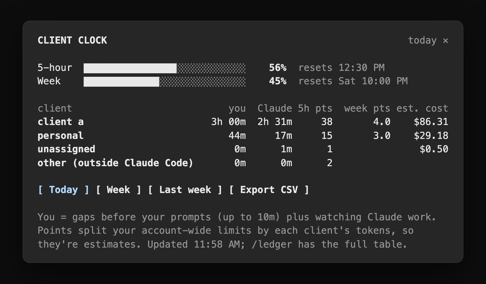

# client-clock

A Claude Code mod that shows which client is using your time and your usage limits.



For each client it logs:

- **your time**: the gap before each prompt you send, up to 10 minutes, plus time you spend watching Claude work from your phone or the web
- **Claude's time**: how long each turn ran
- **each client's share of your 5-hour and weekly limits**, in percentage points
- **estimated cost** at API prices
- **what your time comes to** at your rate for that client
- **time locked out** when a limit hits 100%
- **your commits** on any local branch

Everything stays on your machine.

## Requirements

Claude Code with mods (function hooks). Built and tested on Claude Code 2.1.286. Mods are early access, so a later release may change the API this uses.

## Install

Clone it and point Claude Code at the folder:

```bash
git clone https://github.com/JustinASmith/client-clock ~/.claude/mods/client-clock
```

Then add this to the `env` block of `~/.claude/settings.json` so every session loads it:

```json
"CLAUDE_CODE_PLUGIN_DIRS": "~/.claude/mods/client-clock"
```

To try it in one session first, run `claude --plugin-dir ~/.claude/mods/client-clock`.

The repo is also a plugin marketplace:

```
/plugin marketplace add JustinASmith/client-clock
/plugin install client-clock@client-clock
```

## Use

1. **Label each repo once.** In a client's repo, run `/client acme`. Every session in that repo counts toward acme from then on, and earlier sessions there count too. Other clones of the same repo count as acme as well. For your own projects, `/client personal` logs the time without billing it. In a repo with no label, the band above the prompt asks which client it is.
2. **Open the dashboard** with `/clock`: usage bars with each client's points of the current windows, a row per client, Today, Week and Last week, and CSV export.
3. **Print the table** with `/ledger today`, `/ledger week` or `/ledger lastweek`. `/ledger csv week` writes a CSV. `/ledger add 30m call with acme` adds time you spent away from the keyboard.
4. **Set a rate** with `/client rate 95`. `/ledger` and the pane then show what your time comes to.
5. **Make a timesheet** with `/ledger timesheet week`: one row per day per client with your hours, what they come to, and what you did (your `/ledger add` notes and commit messages that day). It's written as a CSV, ready for an invoice.
6. **Set a budget** with `/client budget 25`, in points of your weekly limit. You get a heads-up when the client reaches it, and when one client is at least half of a 5-hour window that's 80% used.

The band above the prompt shows today's totals for the repo's client.

## Tools that run Claude Code in their own folders

Some tools run Claude Code in a folder of their own instead of your client's repo: HyperFrames Studio keeps a folder per project in `~/.hyperframes-studio`, and scripts and scheduled tasks run wherever they start. Their time and usage are logged like any session's, but no label covers their folders, so they show as "unassigned". Three ways to place them:

- **`/ledger unassigned week`** lists the folders behind "unassigned", with their time and points. The pane names the busiest ones too.
- **A folder rule** labels a tool's folders from any session: `/client acme in ~/.hyperframes-studio/Acme*`. `*` matches any part of a folder name, and a rule covers the folders inside it, including ones the tool makes later. Earlier work in them counts too. `/client forget ~/.hyperframes-studio/Acme*` removes a rule.
- **A pin**: start the tool or script with `CLIENT_CLOCK_CLIENT=acme` in its environment, and the whole session counts for acme, whatever its folder.

A tool that calls Claude without Claude Code (claude.ai, the mobile app, another machine) isn't logged here. Its usage shows as "other", and `/ledger add` covers the time.

## Demo mode

`/clock demo` shows every client as "client a", "client b" and so on, and hides folder names, in the band, the pane, `/ledger`, `/client` and exports. It's for screenshots and screen shares. Each client keeps its letter. `/clock demo off` turns it off.

## How it counts

- **You**: the gap before each prompt you type, capped at 10 minutes so a break doesn't count. Watching from your phone or the web counts while Claude is working. Overlapping sessions count once, split between the clients active at that moment.
- **Claude**: each turn's duration. Turns in parallel sessions can overlap, so this can add up to more than the clock time.
- **Points**: the 5-hour and weekly limits are account-wide, so each rise between two readings is split by what each client's sessions spent at API prices in between. API prices weigh models and output the way limits roughly do, and each session logs its running cost at most once a minute, so a turn still running counts too. When no session logged a cost, the split falls back to tokens. These are estimates.
- **Other and before tracking**: usage it can't tie to any session shows as "other". The usage already in a window when the clock started shows as "before tracking".
- **Cost**: what Claude Code reports the session would cost at API prices, counted from when the clock started.
- **Billable**: your time at the client's rate.
- **Locked out**: time at 100% of a limit, split by each client's share of that window.
- **Commits**: your commits (by `git config user.email`) on any local branch of the client's repos, each counted once even across worktrees.

A session's client comes from, in order: `CLIENT_CLOCK_CLIENT`, the label on its repo's remote, the label on its folder, then the longest folder rule that matches.

## Data

- One JSONL file per session in `~/.claude/client-clock/ledger/`
- CSV exports and timesheets in `~/.claude/client-clock/exports/`
- Labels, rules, budgets, rates and demo mode in the mod's own store

The mod makes no network requests.

## Develop

```bash
claude plugin validate .claude-plugin/plugin.json
claude plugin test .
```

Claude Code writes the API's type declarations into `.claude-plugin/types/` when it loads the mod from your folder.

## License

[MIT](LICENSE)
